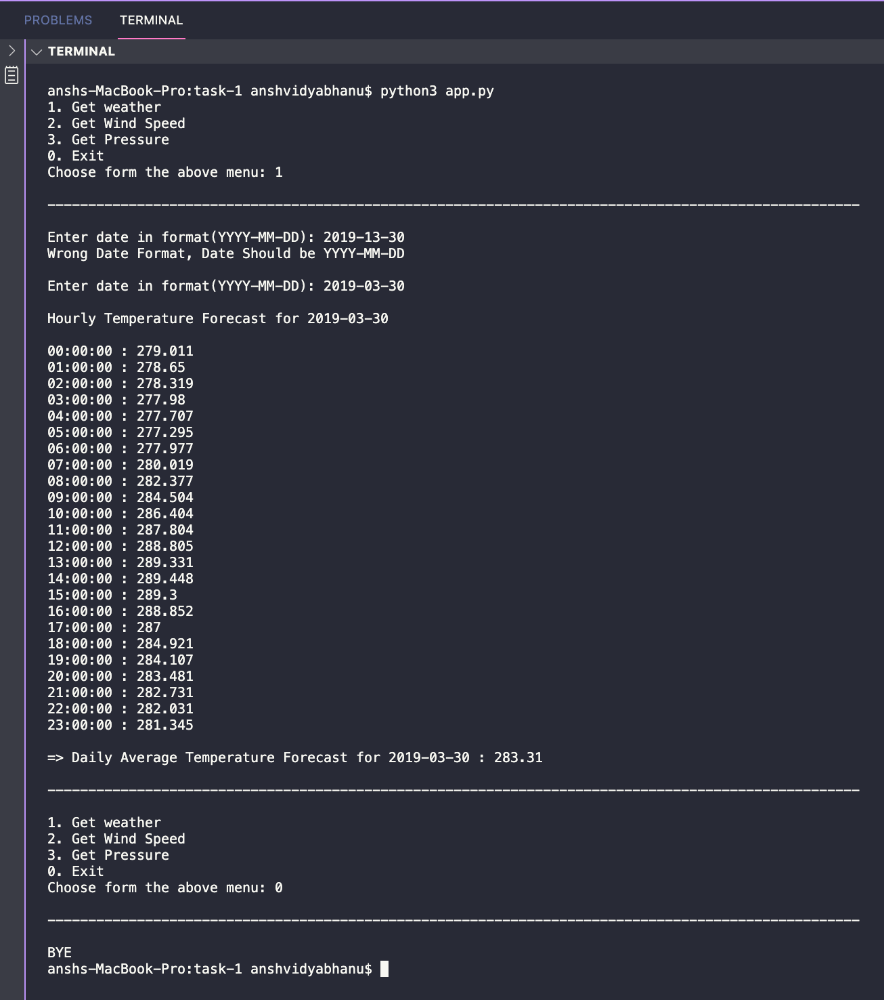

# FireCatchers
This Repo Consists of Solutions to Tasks for the FireQuest Organised by GDG Chandigarh and IEEE CU

# Project directory layout
    .
    ├── app.py                    # Main code Runner Python Code
    ├── weather.py                # Python Code for retreiving Data from API
    └── README.md

# API used
> [samples.openweathermap](https://samples.openweathermap.org/data/2.5/forecast/hourly?q=London,us&appid=b6907d289e10d714a6e88b30761fae22)`API url`

>   API Used    : RESTful API

> HTTP Method : GET

## Given Task
write a program to get the option from the user and print the result based on the above API.
 
1. Get weather
2. Get Wind Speed
3. Get Pressure
0. Exit
 
If the user press 1, Prompt the user for the date then print the temp of the input date.
If the user press 2, Prompt the user for the date then print the wind.speed of the input date.
If the user press 3, Prompt the user for the date then print the pressure of the input date.
If the user presses 0, Terminate the program.
 
The program should not terminate until the user presses 0.
 
The program should be modular. and you can use any programming language and any framework.
Once you complete, check-in the code in GitHub, and share the repository link for review.

## Solution
After Downloading The Code files cd to FireCatchers directory
> Install Requests Modules

```
$ pip3 install requests
```

> Use Terminal/Command Prompt 

```
$ cd task-1
```

> Run Python Code 

```
$ python3 app.py
```

## Screenshots

